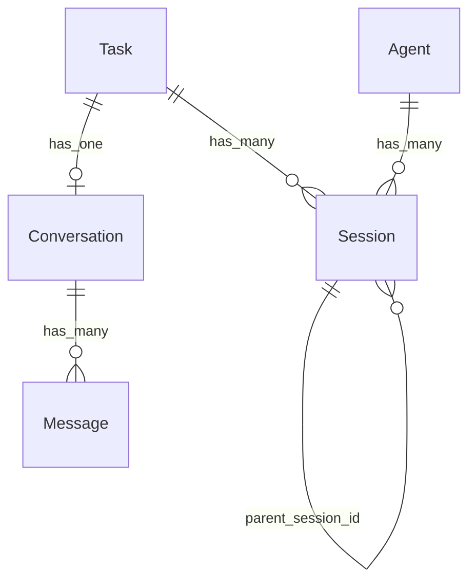
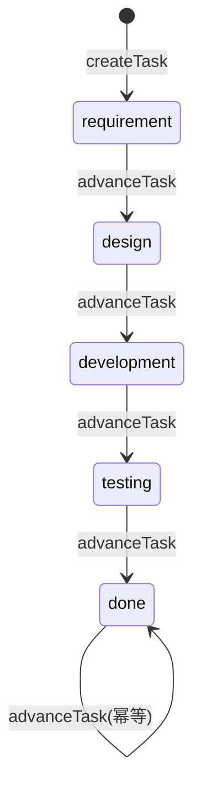
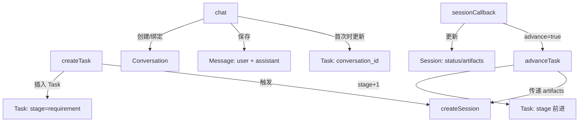
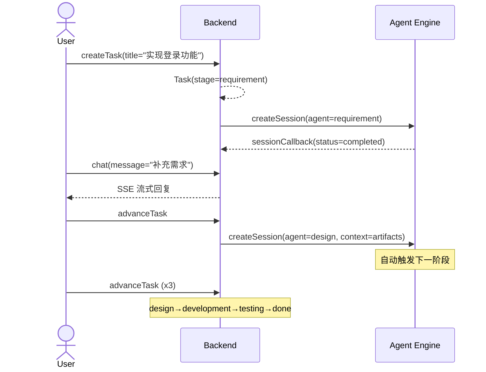

# Biz-Model: 通用业务建模

从项目代码中提取业务描述，输出标准化 Markdown。让 AI 和人都能在一个上下文窗口内完整理解业务。

## 核心理念

业务描述的最小充分结构 = 5 层模型 + 1 个锚点：

1. **实体字典** — 业务里有哪些东西（名词）
2. **关系图** — 东西之间怎么关联（连接）
3. **状态机** — 每个东西的生命周期（时态）
4. **影响图** — 一个动作牵连什么（动词）
5. **不变量** — 什么永远不能违反（规则）
6. **锚定场景** — 一个端到端故事把 5 层串起来

去掉任何一层，AI 对业务的理解就有盲区。

## 输入

- 模块名（如 "task模块"）
- 文件路径
- 不指定 = 全量扫描

## 输出

6 个 Markdown 文件固定放在 `docs/biz-model/` 目录：

```
docs/biz-model/
├── entities.md        # 实体字典
├── relations.md       # 关系图
├── states.md          # 状态机
├── impacts.md         # 影响图
├── invariants.md      # 不变量
├── scenario.md        # 锚定场景
└── extracted/         # 提取的原始数据缓存（JSON）
```

提取的原始数据缓存到 `docs/biz-model/extracted/`，供 review 脚本交叉校验。

## 目录结构

```
biz-model/
├── SKILL.md
├── references/                 # 技术栈适配指南（按需读取）
│   └── go-gin-sqlite.md        # Go + Gin + SQLite（已实现）
└── scripts/
    ├── detect_techstack.sh     # 探测技术栈
    ├── go/                     # Go 提取脚本（已实现）
    │   ├── extract_structs.sh
    │   ├── extract_routes.sh
    │   ├── extract_constraints.sh
    │   └── extract_validations.sh
    ├── python/                 # Python 提取脚本（预留，无脚本时走路径 B）
    ├── java/                   # Java 提取脚本（预留）
    └── common/
        └── validate_models.py  # 交叉引用校验（兼容无 extracted/ 的情况）
```

新增技术栈：在 `scripts/<tech>/` 放提取脚本 + `references/<tech>.md` 写适配指南。没脚本的技术栈走路径 B（纯 AI 推理），skill 照样能跑。

## 执行流程

7 步顺序执行。每步完成后暂停让用户确认。

---

### Step 0: Detect & Extract（强制前置）

1. 运行 `bash scripts/detect_techstack.sh <ROOT>` 探测技术栈
2. 根据输出读对应的 `references/<tech>.md`（如存在）

**两种路径**：

**路径 A — 有提取脚本**（当前支持：Go）

检查 `scripts/<tech>/` 目录是否存在提取脚本。存在则并行运行：

```
mkdir -p docs/biz-model/extracted
bash scripts/<tech>/extract_structs.sh <ROOT> > docs/biz-model/extracted/structs.json
bash scripts/<tech>/extract_routes.sh <ROOT> > docs/biz-model/extracted/routes.json
bash scripts/<tech>/extract_constraints.sh <ROOT> > docs/biz-model/extracted/constraints.json
bash scripts/<tech>/extract_validations.sh <ROOT> > docs/biz-model/extracted/validations.json
```

读取输出确认非空。后续 Step 1-5 标注为"脚本提供"的部分直接读取这些 JSON。

**路径 B — 无提取脚本**（其他技术栈）

不创建 extracted 目录。后续每个 Step 中标注为"脚本提供"的部分改为由 AI 直接从源码提取：

- Step 1：AI 用 LSP 扫描项目实体/模型层，手动记录 struct/class/schema
- Step 3：AI 直接读取 migration/schema 文件提取 DEFAULT 值和约束
- Step 5：AI 直接读取校验代码提取 required/not_null/unique 规则

Review Gate 中的 `validate_models.py` 也兼容此路径：如果 `extracted/` 不存在，跳过脚本数据对照，只做模型间交叉引用校验。

**新增技术栈只需**：添加 `scripts/<tech>/` 提取脚本 + `references/<tech>.md` 适配指南。没脚本也能跑。

---

### Step 1: 实体字典

**脚本提供**：name、fields、source（来自 structs.json）
**AI 补充**：每个实体的业务含义、每个字段的业务含义

**操作**：
1. 读取 `docs/biz-model/extracted/structs.json`
2. 为每个实体写一句话 description：这个实体在业务中是什么、为什么存在
3. 为影响业务决策的字段写 description：字段的业务含义（不是技术含义）
4. 省略纯技术字段（如 id、created_at、updated_at），不解释

**输出** → `docs/biz-model/entities.md`

格式：每个实体用 `## 实体名` 做标题，一段话描述业务含义，然后用表格列出字段和业务含义，最后用 blockquote 标注源码位置。

```markdown
## Task

用户的工作项，从需求到交付的完整生命周期载体。

| 字段 | 业务含义 |
|------|----------|
| stage | 当前阶段（需求→设计→开发→测试→完成） |
| status | 执行状态（待处理/进行中/已完成） |

> 源码：`model/task.go:5`
```

---

### Step 2: 关系图

**完全 AI 推理**。

**操作**：
1. 读取 `docs/biz-model/entities.md` 和 `docs/biz-model/extracted/structs.json`
2. 分析实体间的引用（外键字段、嵌套结构体）
3. 判断关系类型的业务语义：has_many / belongs_to / has_one
4. 用一句话描述关系的业务含义

**输出** → `docs/biz-model/relations.md`

格式：Mermaid erDiagram + 补充表格。

先用 `erDiagram` 展示实体关系全貌，再用表格补充每条关系的业务含义和源码依据。

```markdown
# 关系图



| 从 | 到 | 类型 | 业务含义 | 依据 |
|----|-----|------|----------|------|
| Task | Conversation | has_one | 一个任务关联一个主对话 | tasks.conversation_id |
```

Mermaid erDiagram 语法：`A ||--o{ B : "label"` 表示 A has_many B，`A ||--o| B : "label"` 表示 A has_one B，`A }o--|| B : "label"` 表示 B belongs_to A。

---

### Step 3: 状态机

**脚本提供**：初始状态值（来自 constraints.json 的 DEFAULT）
**AI 推理**：状态跳转路径、前置条件、合法性

**操作**：
1. 读取 `docs/biz-model/extracted/constraints.json`，提取 NOT_NULL_DEFAULT 中的状态字段初始值
2. 读取 service 层代码，找出所有修改状态字段的逻辑
3. 推导合法的状态跳转路径
4. 标记每个跳转的触发动作

**输出** → `docs/biz-model/states.md`

格式：Mermaid stateDiagram-v2 + 补充表格。

每个实体先展示状态跳转全貌图，再用表格补充触发动作和源码依据。

```markdown
## Task

**初始状态**：stage=requirement, status=pending



| 动作 | 从 | 到 | 说明 | 源码 |
|------|----|----|------|------|
| advanceTask | stage=requirement | stage=design | 需求确认后推进到设计阶段 | `service/task.go:AdvanceTask` |
```

只建模有业务含义的状态字段。纯技术状态（如 "是否删除"）不需要建模。

---

### Step 4: 影响图

**完全 AI 推理**。这是传统文档最缺的一层。

**操作**：
1. 对 Step 3 每个有业务含义的 action，追踪 service 方法内的所有副作用
2. 识别跨实体的状态联动（"做 A 会影响 B"）
3. 识别外部副作用（消息队列、缓存、通知、第三方调用）

**输出** → `docs/biz-model/impacts.md`

格式：Mermaid flowchart TD + 分节文字描述。

先用全局 flowchart 展示所有动作的影响链路，再分节用文字描述每个动作的直接影响和副作用。

```markdown
# 影响图



## createTask — 用户创建一个新任务

**直接影响**
- Task：新记录插入，stage=requirement, status=pending

**副作用**
- 自动触发 Agent 创建主会话，开始处理需求阶段（`service/task.go:53`）
```

只记录有业务含义的动作。标准 CRUD（读取列表、获取详情）不需要建模。

---

### Step 5: 不变量

**脚本提供**：显式约束（NOT NULL/PK/FK）、校验规则（binding:required）
**AI 推导**：语义不变量——跨实体的业务规则

**操作**：
1. 读取 `docs/biz-model/extracted/constraints.json`，列出所有数据库约束
2. 读取 `docs/biz-model/extracted/validations.json`，列出所有输入校验
3. 为每个约束/校验生成对应的 invariant
4. **AI 推导额外的语义不变量**：代码里没有显式写但业务上必须成立的规则
5. 按 severity 分级：critical（数据损坏级别）/ high（业务错误级别）/ medium（边界情况）

**输出** → `docs/biz-model/invariants.md`

格式：按 severity 分节，每节用表格列出不变量。

```markdown
## critical — 数据损坏级别

| 名称 | 规则 | 来源 |
|------|------|------|
| ConversationRequiresAgent | Conversation 必须指定 agent_name | 约束：conversations.agent_name NOT NULL |
| MessageBelongsToConversation | Message 必须属于一个存在的 Conversation | 约束：messages.conversation_id FOREIGN KEY |

## high — 业务错误级别

| 名称 | 规则 | 来源 |
|------|------|------|
| TaskStageMustAdvanceSequentially | Task.stage 跳转必须是相邻阶段，不能跳跃 | 语义推导：AdvanceTask 每次只前进一步 |
```

---

### Step 6: 锚定场景

**完全 AI 生成**。

**操作**：
1. 读取 Step 1-5 产出的所有 md 文件
2. 选择一个覆盖最多状态跳转的 happy path
3. 写一个端到端故事，把实体、关系、状态变化、影响、不变量全部串起来
4. 每个步骤标注涉及哪些实体、触发了什么影响、满足哪些不变量

**输出** → `docs/biz-model/scenario.md`

格式：Mermaid sequenceDiagram + 分步文字描述。

先用时序图展示全局流程和参与者交互，再分步用文字描述每步细节。

```markdown
# 锚定场景：用户创建任务并与 Agent 协作完成开发

最典型的业务流程：创建→对话→推进。



## Step 1: 创建任务
- **动作**：createTask
- **角色**：User
- **输入**：title="实现登录功能"
- **结果**：Task(stage=requirement, status=pending)
- **满足不变量**：TaskTitleRequired
```

---

## Review Protocol

### Gate 1（Step 1-2 后）：实体+关系审查

先运行：`python3 scripts/common/validate_models.py <ROOT>`

启动 subagent：
```
读取 docs/biz-model/extracted/structs.json + docs/biz-model/entities.md + docs/biz-model/relations.md
逐条验证：
1. structs.json 中每个 struct 是否都在 entities.md 中（DTO 类除外）
2. entities.md 的描述是否有业务含义（不是字段名翻译）
3. relations.md 引用的实体是否都在 entities.md 中
4. 关系的依据是否有源码支撑
```

### Gate 2（Step 3-5 后）：状态+影响+不变量审查

先运行：`python3 scripts/common/validate_models.py <ROOT>`

启动 subagent：
```
读取全部 docs/biz-model/*.md + docs/biz-model/extracted/*.json
验证：
1. states.md 的初始状态与 constraints.json DEFAULT 一致
2. impacts.md 的 action 与 routes.json 对应
3. invariants.md 覆盖 constraints.json + validations.json 的每一项
4. 影响图不违反不变量
```

### Gate 3（Step 6 后）：场景审查

启动 subagent：
```
读取 docs/biz-model/scenario.md + docs/biz-model/states.md + docs/biz-model/impacts.md
验证：
1. 场景覆盖 states.md 中的主要状态跳转路径
2. 场景的 invariants_held 列表是否正确
3. 场景是否足够"锚定"5 层模型
```

每个 Gate：都 PASS → 下一步；FAIL → 修复重跑，最多 3 轮。

---

## 执行约束

1. **增量更新**：`docs/biz-model/` 已存在模型文件时，读取现有模型只更新变化部分
2. **代码溯源**：每个字段标注源码位置（文件:行号）
3. **只写 docs/biz-model/ 目录**：不修改任何业务代码
4. **描述用业务语言**：不说"string type max 255"，说"任务标题"
5. **省略技术细节**：id、created_at、updated_at 等纯技术字段不建模
6. **省略 CRUD**：标准增删改查不建模，只建模有业务含义的动作
7. **输出格式为 Markdown + Mermaid**：entities.md 和 invariants.md 用表格；relations.md 用 erDiagram；states.md 用 stateDiagram-v2；impacts.md 用 flowchart TD；scenario.md 用 sequenceDiagram。每个文件先放 Mermaid 图展示全貌，再放表格/文字补充细节

## 与其他 skill 的关系

biz-model 是上游基础设施。产出物在 `docs/biz-model/` 目录，供以下 skill 消费：
- **biz-test**：读取 `docs/biz-model/` 下的模型文件生成测试
- **doc-maintainer**：读取模型自动更新项目文档
- 代码生成 skill：基于模型生成 API/service 代码
