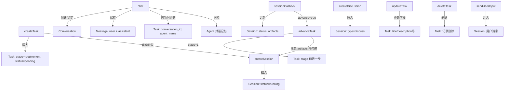

# 影响图

## createTask — 用户创建一个新任务

**���接影响**
- Task：新记录插入，stage=requirement, status=pending

**副作用**
- 自动触发 Agent 创建主会话，开始处理需求阶段（`service/task_service.go:53 triggerAgentForStage`）

## advanceTask — 推进任务到下一阶段

**直接影响**
- Task：stage 前进一步（requirement→design→development→testing→done）

**副作用**
- 自动触发下一阶段的 Agent 创建会话，并收集前序会话的 artifacts 作为上下文传递（`service/task_service.go:142-153`）
- 将所有主会话的 artifacts 串联后传给下一阶段 Agent（`service/task_service.go:144-150`）

## chat — 用户与 Agent 对话

**直接影响**
- Conversation：如对话不存在则自动创建，并绑定到任务
- Message：保存用户消息，Agent 回复流式完成后也保存
- Task：如果是首次对话，更新任务的 conversation_id 和 agent_name

**副作用**
- 消息同步保存到 Agent 的对话记忆中（`service/chat_service.go:57 agent.SaveToMemory`）

## createSession — 创建 Agent 执行会话

**直接影响**
- Session：新会话记录插入，status=running

## createDiscussion — 创建多 Agent 讨论会话

**直接影响**
- Session：新会话记录，type=discuss，包含参与者列表和讨论主题

## sessionCallback — Agent Engine 回调通知会话结果

**直接影响**
- Session：插入或更新会话记录（status、artifacts 等字段）

**副作用**
- 若 advance=true 且 taskID 非空，自动触发 advanceTask 推进任务到下一阶段（`handler/session_handler.go:34-36`）

## updateTask — 用户手动更新任务字段

**直接影响**
- Task：更新 title、description、stage、status、artifacts、agent_name 中的指定字段

**注意**
- 不触发 Agent 会话创建（与 advanceTask 不同），纯数据更新

## deleteTask — 删除任务

**直接影响**
- Task：记录从数据库删除

**注意**
- 关联的 Session、Conversation、Message 不会级联删除（SQLite 无 FK 级联设置），可能产生孤立数据

## sendUserInput — 用户向正在运行的会话发送输入

**直接影响**
- Session：用户消息注入到会话上下文中
