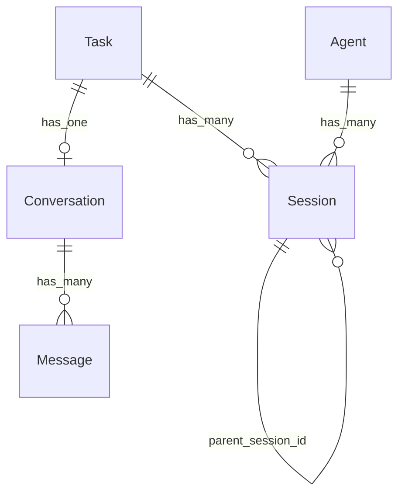

# 关系图

| 从 | 到 | 类型 | 业务含义 | 依据 |
|----|-----|------|----------|------|
| Task | Agent | belongs_to | 每个任务在特定阶段由一个 Agent 负责 | tasks.agent_name → Agent.name |
| Task | Session | has_many | 一个任务可以有多个 Agent 执行会话（每个阶段一个主会话 + 可能的讨论会话） | sessions.task_id |
| Task | Conversation | has_one | 一个任务关联一个主对话，用户通过它与当前 Agent 交互 | tasks.conversation_id |
| Session | Session | has_many | 一个主会话可以派生多个讨论会话（多 Agent 协作） | sessions.parent_session_id |
| Conversation | Message | has_many | 一个对话包含多条消息（用户和 Agent 交替） | messages.conversation_id FK → conversations.id |
| Agent | Session | has_many | 一个 Agent 可以在多个任务中被创建为执行会话 | sessions.agent_name → Agent.name |
