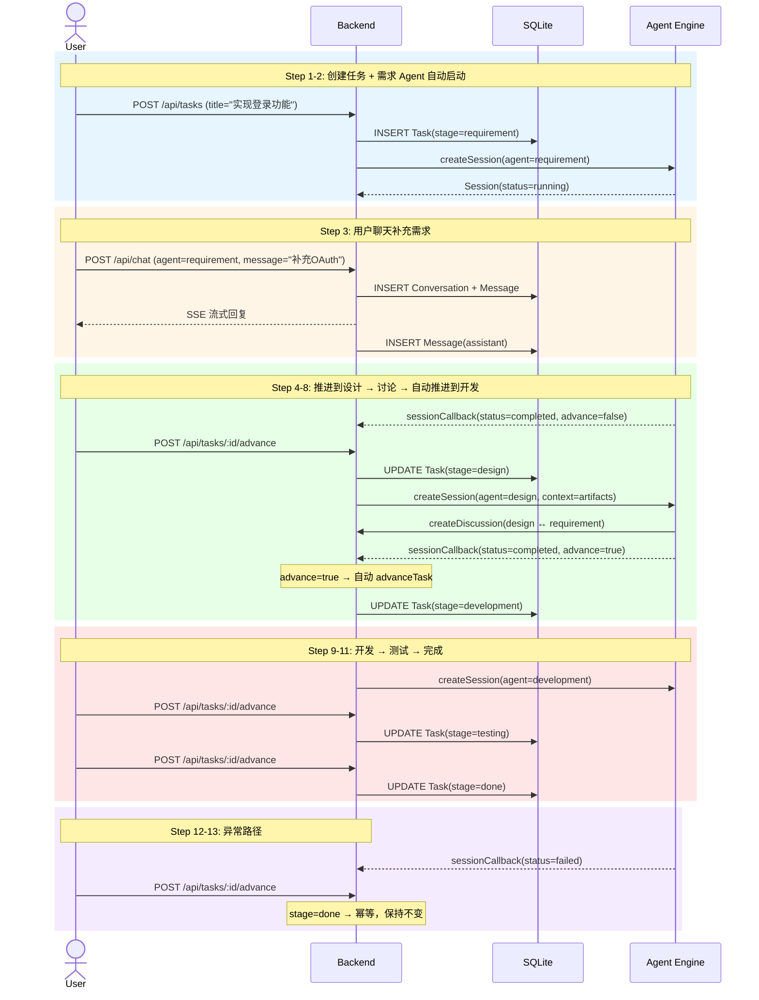

# 锚定场景：用户创建任务，Agent 自动处理并推进阶段

最典型的端到端流程：创建任务 → Agent 自动处理需求 → 用户补充需求（聊天）→ 推进到设计 → Agent 讨论 → 回调推进 → 完成全流程。

## Step 1: 创建任务

- **动作**：createTask
- **角色**：User
- **输入**：title="实现用户登录功能"，description="需要支持邮箱和手机号登录，包含验证码"
- **结果**：Task(stage=requirement, status=pending, agent_name="", artifacts=[])
- **副作用**：系统自动创建 requirement Agent 会话，Agent 开始分析需求
- **满足不变量**：TaskTitleRequired

## Step 2: 需求 Agent 会话启动

- **动作**：createSession
- **角色**：System（自动触发）
- **输入**：agent_name="requirement"，task_id=新任务ID，context=任务标题和描述
- **结果**：Session(type=main, agent_name=requirement, status=running, artifacts=[])
- **满足不变量**：AgentConfigMustHaveName

## Step 3: 用户聊天补充需求

- **动作**：chat
- **角色**：User
- **输入**：agent_name="requirement"，message="还需要支持 OAuth 第三方登录"
- **结果**：Conversation 自动创建并绑定到 Task，Message(user) 保存，Agent 流式回复后 Message(assistant) 保存
- **副作用**：Task 的 conversation_id 和 agent_name 更新，消息同步保存到 Agent 对话记忆
- **满足不变量**：ChatRequiresAgentAndMessage, ConversationRequiresAgentName

## Step 4: Agent Engine 回调完成需求分析

- **动作**：sessionCallback
- **角色**：Agent Engine（外部系统）
- **输入**：session_id=requirement会话ID, task_id=任务ID, status="completed", artifacts=[需求文档], advance=false
- **结果**：Session(status=completed, artifacts=[需求文档])
- **满足不变量**：—

## Step 5: 推进到设计阶段

- **动作**：advanceTask
- **角色**：User
- **结果**：Task(stage=design, status=pending)
- **副作用**：
  - 系统收集 requirement 会话的 artifacts，传递给 design Agent
  - 前序产出物作为设计阶段的输入上下文
- **满足不变量**：TaskStageMustAdvanceSequentially

## Step 6: 设计 Agent 会话启动

- **动作**：createSession
- **角色**：System（自动触发）
- **输入**：agent_name="design"，task_id=任务ID，context=需求产出物+任务描述
- **结果**：Session(type=main, agent_name=design, status=running)
- **满足不变量**：AgentConfigMustHaveName

## Step 7: 多 Agent 讨论技术选型

- **动作**：createDiscussion
- **角色**：System（Agent 主动发起）
- **输入**：initiator=design, participant=requirement, topic="登录方式的技术选型", max_rounds=50
- **结果**：Session(type=discuss, participants=[design, requirement], status=running, current_round=0)
- **满足不变量**：DiscussionRequiresTwoParticipants, SessionMaxRoundsBounded

## Step 8: 讨论完成，回调触发阶段推进

- **动作**：sessionCallback
- **角色**：Agent Engine（外部系统）
- **输入**：session_id=design会话ID, task_id=任务ID, status="completed", artifacts=[设计文档], advance=true
- **结果**：Session(status=completed, artifacts=[设计文档])
- **副作用**：advance=true 自动触发 advanceTask，Task(stage=development)
- **满足不变量**：TaskStageMustAdvanceSequentially

## Step 9: 开发 Agent 启动

- **动作**：createSession
- **角色**：System（自动触发）
- **输入**：agent_name="development"，task_id=任务ID，context=需求+设计产出物
- **结果**：Session(type=main, agent_name=development, status=running)
- **满足不变量**：AgentConfigMustHaveName

## Step 10: 推进到测试阶段

- **动作**：advanceTask
- **角色**：User
- **结果**：Task(stage=testing)
- **副作用**：测试 Agent 启动，基于开发产出物生成测试用例
- **满足不变量**：TaskStageMustAdvanceSequentially

## Step 11: 任务完成

- **动作**：advanceTask
- **角色**：User
- **结果**：Task(stage=done)
- **满足不变量**：TaskStageMustAdvanceSequentially, TaskCannotAdvancePastDone

## Step 12: Agent 执行失败（测试 Agent 出错）

- **动作**：sessionCallback
- **角色**：Agent Engine（外部系统）
- **输入**：session_id=testing会话ID, task_id=任务ID, status="failed", artifacts=[], advance=false
- **结果**：Session(status=failed)
- **满足不变量**：—

## Step 13: 对已完成任务重复推进

- **动作**：advanceTask
- **角色**：User
- **结果**：Task(stage=done)，状态不变（幂等）
- **满足不变量**：TaskCannotAdvancePastDone
