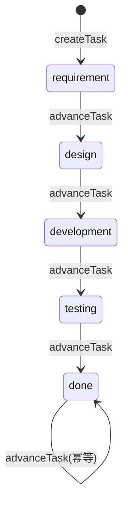
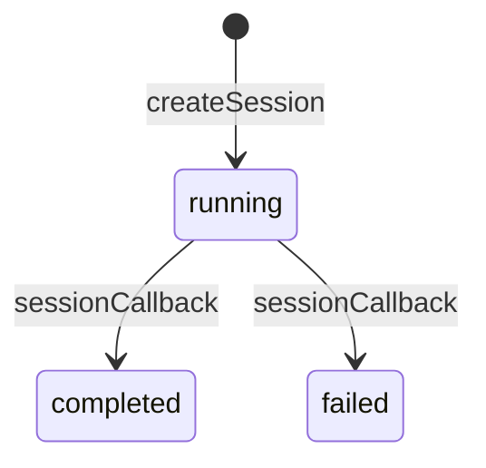

# 状态机

## Task

**初始状态**：stage=requirement, status=pending

| 动作 | 从 | 到 | 说明 | 模块 |
|------|----|----|------|------|
| createTask | — | stage=requirement, status=pending | 创建新任务，初始进入需求阶段 | task-service |
| advanceTask | stage=requirement | stage=design | 需求确认后推进到设计阶段 | task-service |
| advanceTask | stage=design | stage=development | 设计完成后推进到开发阶段 | task-service |
| advanceTask | stage=development | stage=testing | 开发完成后推进到测试阶段 | task-service |
| advanceTask | stage=testing | stage=done | 测试通过后标记为完成 | task-service |
| advanceTask | stage=done | stage=done | 已完成的任务不能再推进，保持 done | task-service |

## Session

**初始状态**：status=running, current_round=0

| 动作 | 从 | 到 | 说明 | 模块 |
|------|----|----|------|------|
| createSession | — | status=running | 创建 Agent 执行会话，立即开始运行 | session-service |
| sessionCallback | status=running | status=completed/failed | Agent Engine 回调通知执行结果 | session-handler |
| completeSession | status=running | status=completed | Agent 执行完成，会话结束 | session-service |
| failSession | status=running | status=failed | Agent 执行出错，会话失败 | session-service |
